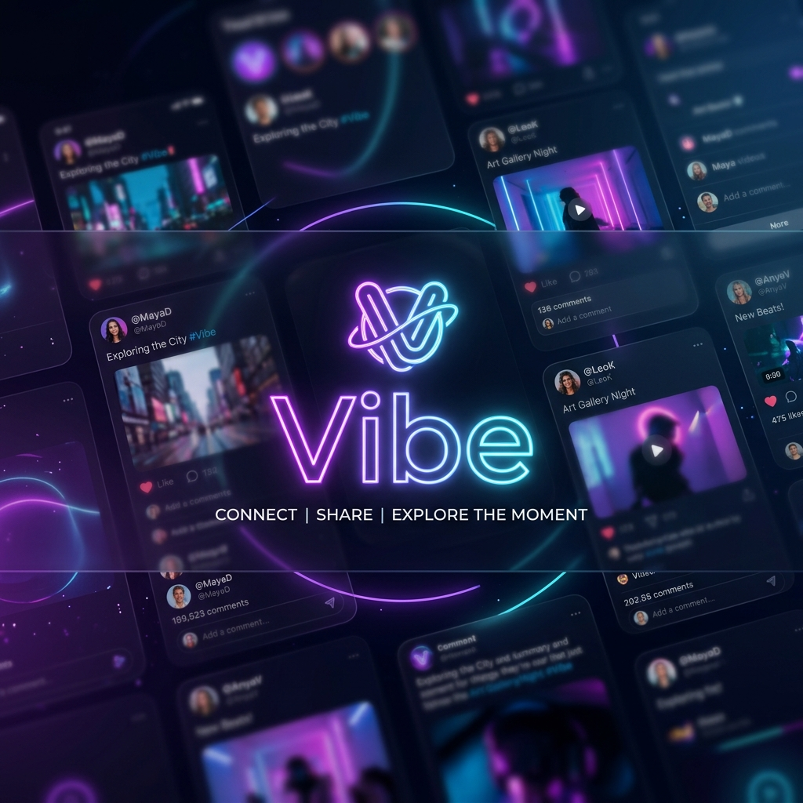
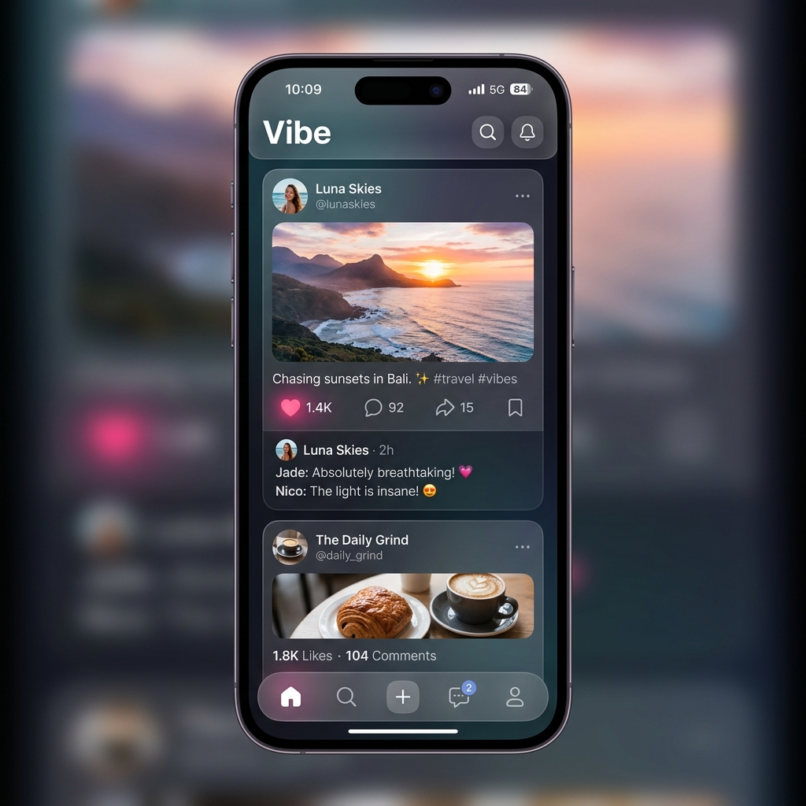
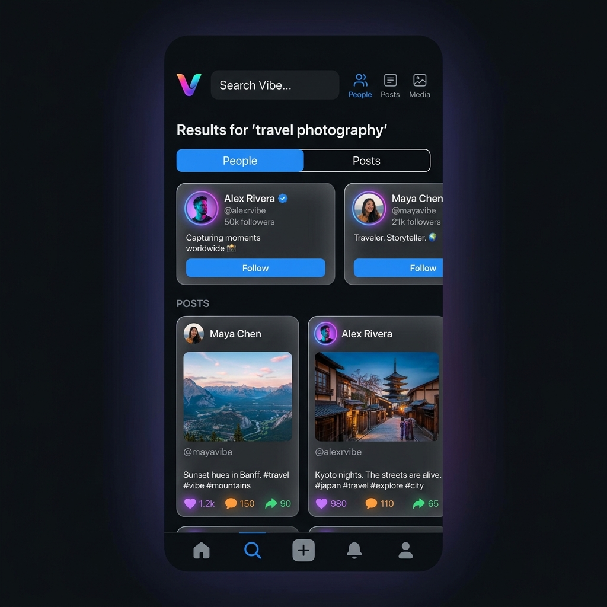

<p align="center">
  
</p>

# Vibe — Social Media Platform



Vibe is a modern, high-performance, and fully responsive full-stack social media application. Built with a pristine dark-themed UI (glassmorphism), real-time WebSockets, and a robust RESTful API, Vibe allows users to connect, share moments, and engage with community content effortlessly.

## 🌟 Features

- **User Authentication**: Secure JWT-based login, registration, and persistent sessions.
- **Real-Time Notifications & Feed**: Socket.IO integration powers live updates for likes, comments, and follows without page reloads.
- **Rich Media Posts**: Upload images seamlessly alongside text (Multer).
- **Interactive Feed**: Infinite scrolling, live dynamic likes (HeartPop animations), and real-time nested comments.
- **Search & Discovery**: Regex-powered global search for users and posts with debounced live suggestions.
- **Profile Customization**: Update bio, avatar, and username with full validation.
- **Beautiful UI/UX**: Professional dark mode, custom loading skeletons (shimmer), smooth toast notifications, and micro-animations.

## 🛠 Tech Stack

- **Frontend**: Vanilla HTML5, CSS3 (Custom Variables, Flexbox/Grid, Animations), Vanilla JavaScript (ES6+), Socket.IO Client.
- **Backend**: Node.js, Express.js.
- **Database**: MongoDB (Mongoose ORM).
- **Real-Time**: Socket.IO.
- **Authentication**: JSON Web Tokens (JWT), bcryptjs.
- **File Uploads**: Multer.

## 📸 Screenshots

| Home/Landing Page | User Feed |
| --- | --- |
|  |  |

| Global Search | User Profile |
| --- | --- |
|  |  |

*(Professional assets generated and integrated into the project documentation).*

## 🚀 Installation & Local Setup

### Prerequisites
- Node.js (v18+)
- MongoDB (Local instance or MongoDB Atlas cluster)

### 1. Clone the repository
```bash
git clone https://github.com/yourusername/vibe-social-media.git
cd vibe-social-media
```

### 2. Install Dependencies
```bash
npm install
```
*(This runs the root installation script which automatically navigates into `backend/` and installs all necessary packages).*

### 3. Environment Variables
Create a `.env` file in the `backend/` directory and add the following keys:
```env
NODE_ENV=development
PORT=5000
MONGO_URI=your_mongodb_connection_string
JWT_SECRET=your_super_secret_jwt_key
JWT_EXPIRES_IN=30d
```

### 4. Run the Application (Development Mode)
```bash
cd backend
npm run dev
```
The backend will run on `http://localhost:5000` and the frontend UI can be accessed by opening `frontend/public/index.html` in your browser (or using Live Server).

---

## 🔌 API Routes

### Authentication
- `POST /api/auth/register` - Register a new user
- `POST /api/auth/login` - Login user
- `GET /api/auth/me` - Get current user profile (Protected)

### Posts
- `GET /api/posts` - Get all posts (Supports Pagination `?page=1&limit=5`)
- `POST /api/posts` - Create a post (Protected, supports `multipart/form-data`)
- `PUT /api/posts/:id` - Edit post caption (Protected)
- `DELETE /api/posts/:id` - Delete post (Protected)
- `PUT /api/posts/:id/like` - Toggle like on a post (Protected)

### Comments
- `GET /api/comments/post/:postId` - Get comments for a post
- `POST /api/comments` - Add a comment (Protected)
- `DELETE /api/comments/:id` - Delete a comment (Protected)

### Users & Profiles
- `GET /api/users/:id` - Get user profile
- `PUT /api/users/:id` - Update user profile (Protected)
- `PUT /api/users/:id/avatar` - Update profile image (Protected)
- `PUT /api/users/:id/follow` - Follow a user (Protected)
- `PUT /api/users/:id/unfollow` - Unfollow a user (Protected)

### Search
- `GET /api/search?q=query` - Global search across users and posts

---

## 🌍 Deployment

This repository is strictly configured for monolithic deployment on platforms like **Render**, **Railway**, or **Vercel**.

### Deploying to Render / Railway
1. Push this repository to GitHub.
2. Create a new **Web Service** on Render/Railway.
3. Connect your GitHub repository.
4. **Configuration Settings:**
   - **Build Command**: `npm install`
   - **Start Command**: `npm start`
5. **Environment Variables**: Add your `MONGO_URI`, `JWT_SECRET`, and set `NODE_ENV=production`.
6. Deploy!
   - *In production mode, the Express backend automatically serves the `frontend/public` directory as static files. No separate frontend hosting is required.*

## 📄 License
This project is licensed under the MIT License.
