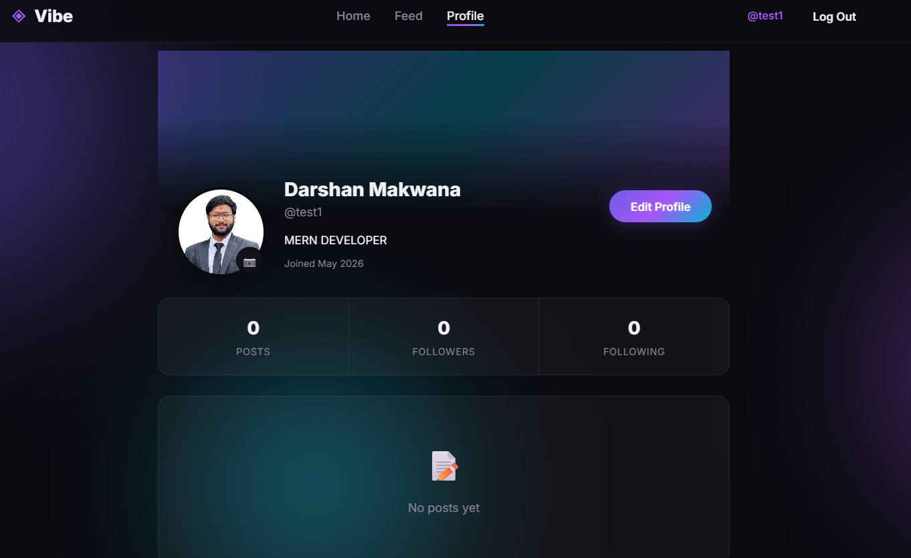
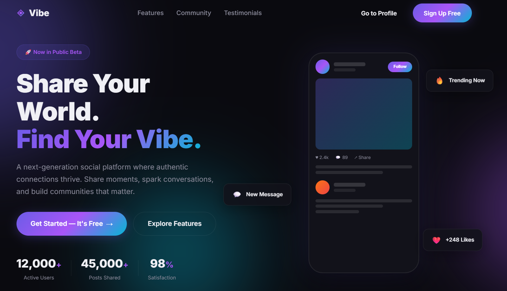
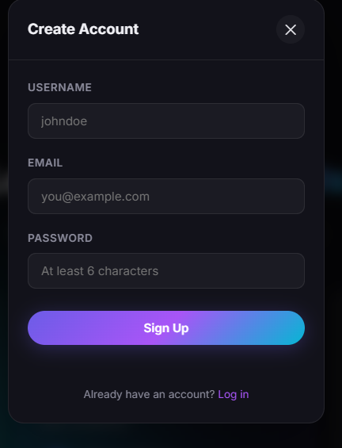
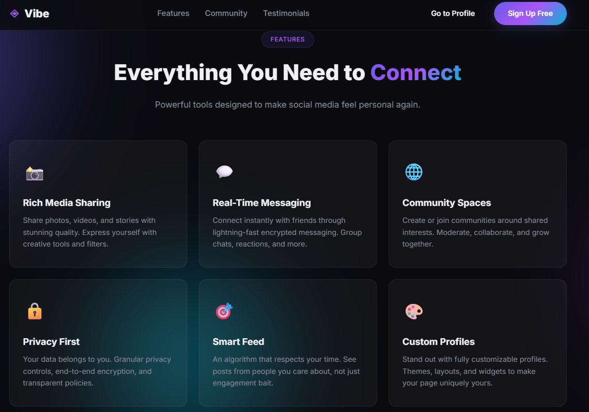

<div align="center">
  
  
  # ◈ Vibe — Modern Social Media Platform

  
  **A full-stack, robust, and highly aesthetic social media platform built from the ground up.**

  [](https://nodejs.org/)
  [](https://expressjs.com/)
  [](https://www.mongodb.com/)
  [](https://developer.mozilla.org/en-US/docs/Web/JavaScript)
</div>

---

## 📖 Overview

**Vibe** is a fully custom, modern social media platform designed with a focus on high-performance backend architecture and stunning "glassmorphism" frontend aesthetics. 

Unlike heavily abstracted platforms, Vibe's backend is meticulously crafted using **Node.js, Express, and MongoDB**, featuring custom JWT authentication, advanced file-upload handling via Multer, and robust error management. The frontend is built completely in **Vanilla CSS & JS** to ensure zero-bloat, lightning-fast rendering, and smooth CSS animations.

---

## 📸 Application Showcase

### 1. Landing Page Hero Interface

> *The hero section of the landing page features a stunning, dark-mode glassmorphism design with animated background orbs, floating interaction cards, and dynamic statistics counters. It is fully responsive and visually striking.*

### 2. Powerful Features Overview

> *A clean, grid-based layout highlighting the platform's core capabilities. Each feature card utilizes subtle hover animations and distinct, vibrant icons to create a premium browsing experience.*

### 3. Seamless Authentication Modals

> *Authentication is handled via sleek, asynchronous modals directly on the landing page. This allows users to Sign Up or Log In without jarring full-page reloads, providing a modern Single Page Application (SPA) feel while maintaining raw HTML/JS performance.*

### 4. Dynamic User Profiles

> *The user profile dashboard showcases a customizable avatar (handled securely via backend Multer disk-storage), interactive stat counters for posts and followers, and an optimistic UI for profile editing.*

---

## ✨ Key Features & Completed Work

### 🛡️ Authentication & Security
- **JWT Session Management:** Secure `protect` and `optionalAuth` middleware for granular route protection.
- **Password Cryptography:** BCrypt integration (12 salt rounds) implemented directly via Mongoose Pre-Save hooks.
- **Data Validation:** Strict Regex validations for usernames and emails; duplicate account prevention.

### 👤 User Profile System
- **Dynamic Profiles:** Custom URL routing by `_id` or `username`.
- **Social Graph Engine:** Robust Follow / Unfollow logic with self-follow prevention and optimistic UI updates.
- **Avatar Uploads:** Handled via `multer` disk-storage with strict mimetype and size (5MB) validations.

### 📝 Post & Feed Engine
- **Rich Media Posts:** Create posts with text and image uploads.
- **Social Interactions:** Like/Unlike toggles and commenting system.
- **Paginated Feed:** Backend feed generation with deep population of author and comment user data.

### 🎨 Frontend Aesthetics
- **Glassmorphism UI:** Blurred backgrounds, glowing orbs, and dark-mode by default.
- **Asynchronous Modals:** Seamless Login/Register modals right on the landing page without full page reloads.
- **Drag & Drop Uploads:** Custom drag-and-drop file uploader with `FileReader` image previews.
- **Optimistic UI:** Like counters and Follow states update instantly before the API request finishes.

---

## 🛠️ Technology Stack

| Domain | Technology | Description |
|---|---|---|
| **Frontend** | HTML5, CSS3, Vanilla JS | Zero-dependency, lightweight, custom glassmorphism design |
| **Backend** | Node.js, Express.js | High-performance RESTful API infrastructure |
| **Database** | MongoDB, Mongoose | NoSQL schema design, virtuals, and DB event listeners |
| **Authentication**| JSON Web Tokens (JWT) | Stateless authentication |
| **Cryptography** | bcryptjs | Secure password hashing |
| **File Handling** | Multer | Multipart/form-data parsing for image uploads |

---

## 📂 Project Architecture

```text
📦 Social-Media-Platform
 ┣ 📂 backend/
 ┃ ┣ 📂 config/        # DB connection, Env Validator, Multer config
 ┃ ┣ 📂 controllers/   # Route logic (auth, user, post)
 ┃ ┣ 📂 middleware/    # JWT Auth and Central Error Handler
 ┃ ┣ 📂 models/        # Mongoose Schemas (User, Post)
 ┃ ┣ 📂 routes/        # Express routers
 ┃ ┣ 📂 uploads/       # Local storage for avatars and post images
 ┃ ┣ 📜 server.js      # App entry point
 ┃ ┗ 📜 package.json
 ┣ 📂 frontend/
 ┃ ┗ 📂 public/
 ┃   ┣ 📂 css/         # Modular stylesheets (style, profile, upload)
 ┃   ┣ 📂 js/          # API integration logic (app, profile, upload)
 ┃   ┣ 📜 index.html       # Landing Page + Auth Modals
 ┃   ┣ 📜 profile.html     # User Profile Page
 ┃   ┗ 📜 create-post.html # Drag & Drop Post Creator
 ┗ 📜 README.md
```

---

## 🚀 Installation & Setup

Want to run Vibe locally? Follow these steps:

### 1. Prerequisites
- [Node.js](https://nodejs.org/en/) (v16 or higher)
- [MongoDB](https://www.mongodb.com/) (Running locally or via MongoDB Atlas)

### 2. Clone & Install
```bash
# Clone the repository
git clone https://github.com/karmaboy1309/Social-Media-Platform.git
cd Social-Media-Platform

# Navigate to backend and install dependencies
cd backend
npm install
```

### 3. Environment Variables
Create a `.env` file inside the `backend/` directory:
```env
PORT=5000
NODE_ENV=development
MONGO_URI=mongodb://127.0.0.1:27017/social_media_platform
JWT_SECRET=your_super_secret_jwt_key_here
MAX_FILE_SIZE=5242880
```

### 4. Run the Platform
Open two terminal windows:

**Terminal 1 (Backend API):**
```bash
cd backend
npm run dev
```

**Terminal 2 (Frontend Server):**
```bash
cd frontend/public
npx serve -p 3000
```
*Now visit `http://localhost:3000` in your browser!*

---

## 📡 Core API Routes

### Authentication (`/api/auth`)
- `POST /register` - Create account
- `POST /login` - Authenticate and receive JWT
- `GET /me` - Get current logged-in user

### Users (`/api/users`)
- `GET /:id` - Get user profile and post count
- `PUT /:id` - Update bio/name (Protected)
- `PUT /:id/avatar` - Upload profile picture (Protected)
- `PUT /:id/follow` - Follow user (Protected)
- `PUT /:id/unfollow` - Unfollow user (Protected)

### Posts (`/api/posts`)
- `GET /` - Get paginated feed
- `POST /` - Create post with optional image (Protected)
- `DELETE /:id` - Delete post and cleanup media (Protected)
- `PUT /:id/like` - Toggle like status (Protected)
- `POST /:id/comment` - Add comment (Protected)

---

<div align="center">
  <p>Built with ❤️ by Karmaboy1309</p>
</div>
